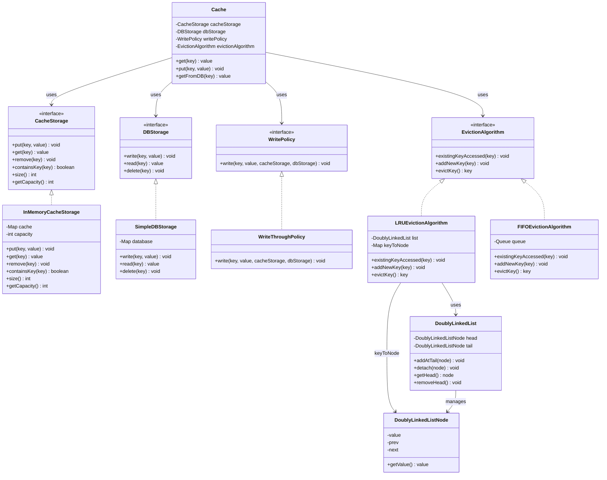
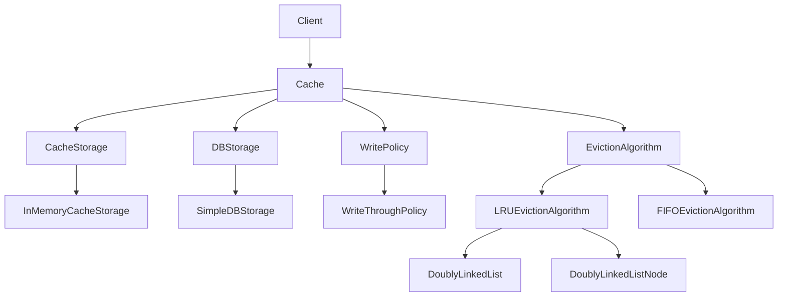

# Cache Class Diagram



## Design Overview



## Eviction Strategy

```text
                 EvictionAlgorithm
                  <<interface>>
                        |
              +---------+---------+
              |                   |
              ▼                   ▼
     LRUEvictionAlgorithm   FIFOEvictionAlgorithm
              |
              |
              ▼
      DoublyLinkedList
              |
              ▼
    DoublyLinkedListNode
```

### EvictionAlgorithm Responsibilities

```text
existingKeyAccessed(key)
    → Existing key was accessed

addNewKey(key)
    → New key entered the cache

evictKey()
    → Cache is full
    → Return key that should be removed
```

### LRU

```text
LRUEvictionAlgorithm
        |
        +-- HashMap<Key, Node>
        |
        +-- DoublyLinkedList
```

### FIFO

```text
FIFOEvictionAlgorithm
        |
        +-- Queue<Key>
```

## Strategy Pattern

```text
Cache
 |
 +---- WritePolicy
 |        |
 |        +---- WriteThroughPolicy
 |
 +---- EvictionAlgorithm
          |
          +---- LRUEvictionAlgorithm
          |
          +---- FIFOEvictionAlgorithm
```

`Cache` depends on the **interfaces**, so the eviction strategy can be changed without modifying `Cache`.
